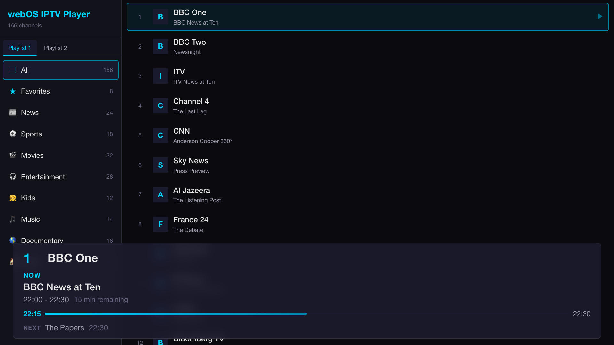

# webOS IPTV Player

An IPTV player for LG webOS TVs. Supports M3U playlists, XMLTV programme guides, and catch-up/timeshift playback.


## Preview



## Features

- **M3U Playlist Support** — Load multiple M3U/M3U8 playlists with auto-deduplication
- **LAN M3U Upload** — Drop `.m3u` files onto the TV from any phone/laptop on the same network via a QR-scannable upload page; new playlists appear in Settings within milliseconds (push, not polling). See [`upload-service/README.md`](upload-service/README.md) for details.
- **Electronic Programme Guide (EPG)** — Three-pane layout (channels / date bar / programmes), date range auto-derived from EPG data, with IndexedDB caching for instant reopen
- **Catch-up / Timeshift** — Play past programmes using `catchup-source` URL templates from M3U
- **Channel Search** — Find channels by name from both the channel list and the player sidebar; focus the search box and press OK to type. Search spans all groups and is scoped to the selected playlist tab
- **Channel Sidebar** — Quick channel switching overlay with current programme info and auto-scrolling text
- **Magic Remote Support** — Pointer-driven navigation for sidebar, menu, and channel selection
- **Spatial Navigation** — Full D-pad/remote navigation across all views
- **On-Screen Display** — Channel info bar with programme title, progress timeline, and timestamps
- **Favorites** — Mark and filter favorite channels
- **Auto-play** — Resume last watched channel on startup
- **Desktop Preview** — Browser-based preview with HLS.js and mpegts.js fallbacks

## Install on your TV

1. **Download the app.** On your computer, open the
   [Releases page](https://github.com/lennylxx/webos-iptv-player/releases/latest)
   and download the latest `.ipk` file.

2. **Install the webOS CLI tools.** Install [Node.js](https://nodejs.org/) (v18+), then run:

   ```bash
   npm install -g @webos-tools/cli
   ```

3. **Turn on Developer Mode on the TV.**
   - Create a free account at the [LG webOS Developer site](https://webostv.developer.lge.com/).
   - On the TV, open the **LG Content Store**, search for **Developer Mode**, then
     install and open it.
   - Sign in with your LG developer account and switch **Dev Mode Status** to **ON**.
     The TV restarts. Note the **IP address** and **passphrase** the app shows.

4. **Register your TV.** Add it as a device named `tv` (replace the IP with your TV's):

   ```bash
   ares-setup-device --add tv -i "username=prisoner" -i "host=127.0.0.1" -i "port=9922"
   ```

   Then fetch the device key, entering the **passphrase** from the Developer Mode app when prompted:

   ```bash
   ares-novacom --device tv --getkey
   ```

5. **Install the app.**

   ```bash
   ares-install --device tv ./com.lennylxx.iptv_<version>_all.ipk
   ```

## Requirements

- [Node.js](https://nodejs.org/) (v18+)
- [webOS CLI tools](https://webostv.developer.lge.com/develop/tools/cli-installation) (`ares-*` commands)

## Setup

```bash
npm install
```

## Build

```bash
./build.sh
```

## Build & Install to TV

```bash
./build.sh --install [device-name]
```

If no device name is given, the default device from `ares-setup-device` is used.

## Preview in Browser

```bash
npm run preview
```

Opens at http://localhost:3000. Video playback uses HLS.js/mpegts.js on desktop since browsers lack native TS/HLS support.

## Settings

Open with the **Blue** key or click the gear icon in the channel list. Sections:

- **Playlists** — add, edit, or remove M3U URLs. Re-applied on Save.
- **Upload Playlist** — QR code + LAN URL on the left, list of currently uploaded playlists on the right. Scan the QR from a phone/laptop on the same network to upload `.m3u` files; they appear in this list within milliseconds via Luna push.
- **EPG (Electronic Program Guide)** — set the XMLTV URL (also auto-detected from `x-tvg-url` in M3U).
- **Playback** — toggle auto-play (resume last watched channel on launch).
- **Data Management** — *Refresh All Data* re-fetches playlists and EPG; *Clear Cache* drops the cached playlist + EPG.
- **Save & Apply** reloads channels from the new sources. **Cancel** discards edits.

## Remote Control Mapping

| Key | Player | Channel List | EPG |
|-----|--------|-------------|-----|
| Up/Down | Channel +/- | Navigate | Navigate within pane |
| Left | Open sidebar | — | Back to channels / previous day |
| Right | Open menu | — | To programmes / next day |
| OK/Enter | Toggle OSD | Select channel / Open settings (gear) | Play channel / programme (catch-up if past) |
| Back | Stop & return | Exit app (press twice) | Close guide |
| Red | Open EPG | Open EPG | — |
| Blue | Open settings | Open settings | Close guide |
| Yellow | Show OSD | — | — |
| Green | Toggle favorite (in sidebar/menu) | Toggle favorite (on focused channel) | Jump to today |
| Ch +/- | Channel +/- | Page up/down | Jump 10 channels |
| 0-9 | Direct channel entry | Direct channel entry | — |
